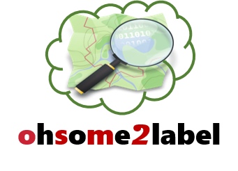
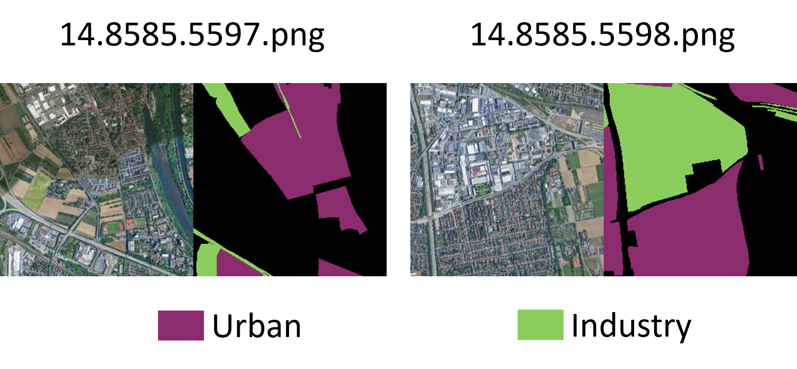

# ohsome2label

[](https://www.tidyverse.org/lifecycle/#experimental) [](https://opensource.org/licenses/MIT)

<p align="center">

</p>

### Historical OpenStreetMap Objects to Machine Learning Training Samples

The **ohsome2label** offers a flexible label preparation tool for satellite machine learning applications.

- **Customized Object** - user-defined geospatial objects are retrieved and extracted from OpenStreetMap full-history data by requesting [ohsome](https://api.ohsome.org/) web API. 
- **Various Satellite Images** - user could downloads corresponding satellite imagery tiles from different data providers.
- **Seamless Training** - object labels together with images would be packaged and converted to [Microsoft COCO](http://cocodataset.org/#format-data) .json format to provide a seamleass connection to further model training.
- **OSM Quality Measurement (currently under developing)** - hitorical OpenStreetMap anaylsis allows us to provide exclusive intrinsic quliaty measurements in addition to the customized training samples.

The output package could support directly training of popular machine learning tasks (e.g., object detection, semantic segmentation, instance segmentation etc,). 

### Package Dependencies

* python 3.6

### Installation

 
 ``` 
 pip install ohsome2label
 ```

### Configuration

We believe you are familiar with [OpenStreetMap](https://www.openstreetmap.org/#map=15/47.1577/3.8563):round_pushpin:, othewise you are highly recommended to check this out since OpenStreetMap contains a huge types of geographical data, ranging from highways to different buildings. Before you start playing around wiht ohsome2labe, you have to specify parameters, such as the target bouding box or the geospatial object you are looking for. 
 
Here is a example for [config.yaml](config/config.yaml) file.
 
```yaml

project:
  name: HD_landuse
  workspace: ./example_result
  project_time: 2020-05-18
  task: segmentation

osm:
  api: ohsome
  url: https://api.ohsome.org/v0.9/elements/geometry
  bboxes: [8.625,49.3711,8.7334,49.4397]
  tags:
    - {'label': 'urban', 'key': 'landuse', 'value': 'residential'}
    - {'label': 'urabn', 'key': 'landuse', 'value': 'garages'}
    - {'label': 'industry', 'key': 'landuse', 'value': 'railway'}
    - {'label': 'industry', 'key': 'landuse', 'value': 'industrial'}

  timestamp: 2019-10-20
  types: polygon

image:
  img_api: bing
  api_token : 'YOUR OWN API TOKEN'
  zoom: 16

```

| Scheme | Parameter | Description |
| -- | -- | -- |
| **project** | `name` | The title of project you want to have. |
| **project** | `workspace` | The relative path your want to store the project output. |
| **project** | `project_time` | The created time of the project. |
| **project** | `task` | The type of machine learning tasks you would like to use afterwards. This could be `object detection`, `segmentation`.|
| **osm** | `api` | The OSM data query API, which could be `ohsome`, `overpass`. |
| **osm** | `url` | The corresponding URL for OSM data query API , which could be `https://api.ohsome.org/v0.9/elements/geometry`, `https://lz4.overpass-api.de/api/interpreter`. |
| **osm** | `bboxes` | The box boundary of target area, which is given in form `[xmin, ymin, xmax, ymin]`, x and y refer to longitude and latitude. The default map project is WGS84. |
| **osm** | `tags` | The target key and values pairs of OSM feature, where `label` could be defined by yourself and shared by several key-value paris. A valid OSM key is necessary, where OSM values could be empty means all values are included. |
| **osm** | `timestamp` | The timestamp of historical OSM data you want to retrieval. The date should be given in `[year-month-day]` |
| **osm** | `types` | The object types you are aimed at, which could be `polygon`, `line`. |
| **image** | `image_api` | The satellite imagery service you would like to use. Now `bing`,`mapbox`, `sentinel` are supported. |
| **image** | `api_token` | The API token should be applied individually by users. Please find the corresponding application pages as follows: [`bing`](https://www.bingmapsportal.com/), [`mapbox`](https://docs.mapbox.com/help/how-mapbox-works/access-tokens/), [`sentinel`](https://services.sentinel-hub.com/oauth/auth?client_id=30cf1d69-af7e-4f3a-997d-0643d660a478&redirect_uri=https%3A%2F%2Fapps.sentinel-hub.com%2Fdashboard%2FoauthCallback.html&scope=&response_type=token&state=%252F) |
| **image** | `zoom` | The zoom-in level of satellite imagery. This ['zoom level'](https://wiki.openstreetmap.org/wiki/Zoom_levels) would affect the spatial resolution in general.|

### Command line functions

Once the [config.yaml](config/config.yaml) is well prepared, now **ohsome2label**  would help your to prepare your customized OSM training samples by using the following command line functions.
Please notice, you could define your own config.yaml file for all command line functions, for instance  ```  ohsome2label --config PATH/OWN_config.yaml vector ``` .
### Help

Check out the summary of ohsome2labl command line function with the following command.
 
 ```bash
$ ohsome2label --help
-------------------------
Usage: ohsome2label [OPTIONS] COMMAND [ARGS]...

  Generate training label for deep learning via ohsomeAPI

Options:
  -v, --verbose
  --config PATH
  --schema PATH
  --help         Show this message and exit.

Commands:
  image      Download satellite image
  label      Generate tile
  printcfg   Print project config
  vector     download vector OSM data from ohsomeAPI
  visualize  Visualize of training samples


```

### Vector

Download the historical OpenStreetMap vector data with the given timestamp by querying the [ohsome](https://api.ohsome.org/) API. The results is in -gzip format, you could unzip it to -geojson file with tools like [7zip](https://www.7-zip.org/).

```bash
$ ohsome2label vector
-------------------------
Options:
  -v, --verbose
  --config PATH
  --schema PATH
-------------------------
Download OSM historical data into dir:

.\deepvgi-ohsome2label\example_result\other\raw

```

### Label

The downloaded OpenStreetMap data together with the target objects would be labelled with specific zoom level. The label output also depends on different `ML_task`, for examples, object bounding boxes for `object detection`, object footprints for 'semantic segmentation', and instance footprint for `instance segmentation`.

```bash
$ ohsome2label label
-------------------------
Options:
  -v, --verbose
  --config PATH
  --schema PATH
-------------------------

Tile the OSM data into given zoom level: 14

24it [00:00, 119.13it/s]


```

### Image

Based on the previous label results, user could download the correspondingly satellite image for training.

```bash
$ ohsome2label image 
-------------------------
Options:
  -v, --verbose
  --config PATH
  --schema PATH
-------------------------
Start download satellite image!
100%|█████████████████████████████████████████████████████████████████████████████████████████████████████████████████████████████████████████████████████████████████████| 24/24 [00:03<00:00,  6.57it/s]


```

### Visualization

Visualize example satellite image together with OpenStreetMap features. Requires the `/tile` folder from the previous step. Accepts an additional flag:
- `-n` or `--num`: _integer_ number of examples images to create per class. (default: `50`)
- `-t` or `--type`: _str_ the visualization type should be selected from `combined` or `overlay` (default: `combined`) 


```bash
$ ohsome2label visualize -n 10
-------------------------
Options:
  -v, --verbose
  --config PATH
  --schema PATH
-------------------------
start visualize 10 pictures!

Visualization mode: combined the satellite image with OpenStreetMap features.


```
With the default Heidelberg example, you would get the following training samples for landuse classes: urban and Industry.

<p align="center">

</p>


### Print the configuration

Users could use the print configuration to check their configuration regarding the project.

```bash
$ ohsome2label printcfg
-------------------------
Options:
  -v, --verbose
  --config PATH
  --schema PATH
-------------------------
# # # # # # # # # # #  CONFIG  # # # # # # # # # # #
{'_config': {'image': {'api_token': '', 'img_api': 'google', 'zoom': 14},
             'osm': {'api': 'ohsome',
                     'bboxes': [8.625, 49.3711, 8.7334, 49.4397],
                     'tags': [{'key': 'landuse',
                               'label': 'urban',
                               'value': 'residential'},
                              {'key': 'landuse',
                               'label': 'urban',
                               'value': 'garages'},
                              {'key': 'landuse',
                               'label': 'industry',
                               'value': 'railway'},
                              {'key': 'landuse',
                               'label': 'industry',
                               'value': 'industrial'}],
                     'timestamp': datetime.date(2019, 10, 20),
                     'types': 'polygon',
                     'url': 'https://api.ohsome.org/v0.9/elements/geometry'},
             'project': {'name': 'HD_landuse',
                         'project_time': datetime.date(2020, 5, 18),
                         'task': 'segmentation',
                         'workspace': './example_result'}}}

# # # # # # # # # # # #  END  # # # # # # # # # # # #

```


### Acknowledgements

The package relies heavily on the [OpenStreetMap History Data Analysis Framework](https://github.com/GIScience/oshdb) under the [ohsome](https://api.ohsome.org) API. The idea of this package has been inspired by the excellent work of [label-maker](https://github.com/developmentseed/label-maker). Last but not lease, we would like to thanks for the contributions of OpenStreetMap volunteer to make this happen.
- OpenStreetMap historical data used that contains [ODbL 1.0](https://opendatacommons.org/licenses/odbl/) licensed OSM history data for dates after September 12, 2012 and [CC-BY-SA 2.0](https://planet.osm.org/cc-by-sa/) licensed OSM history data for all dates prior to September 12, 2012.
