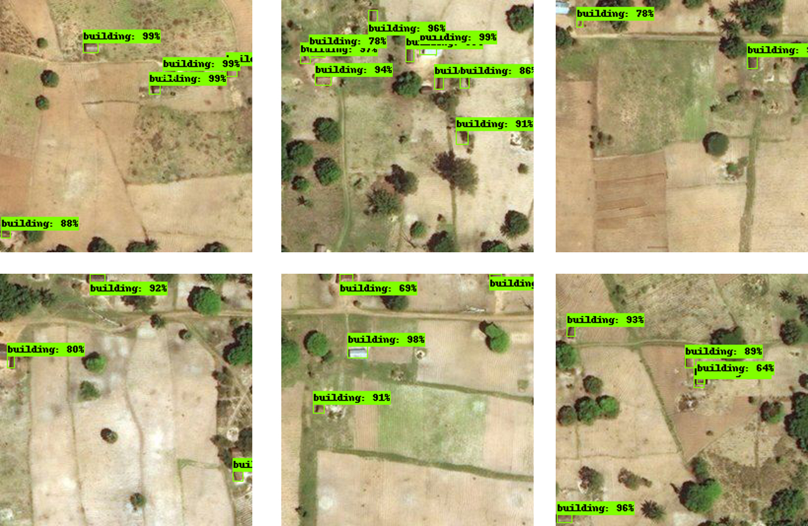
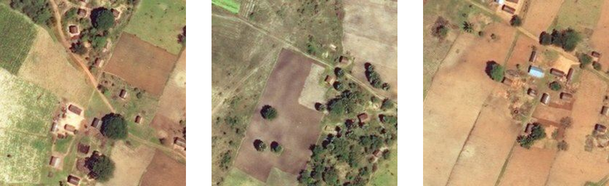
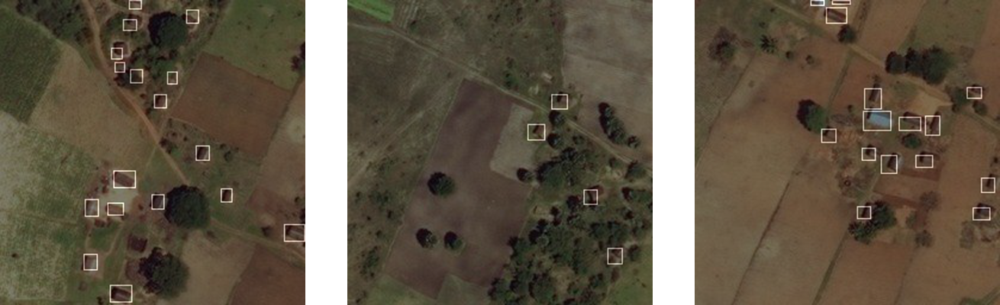
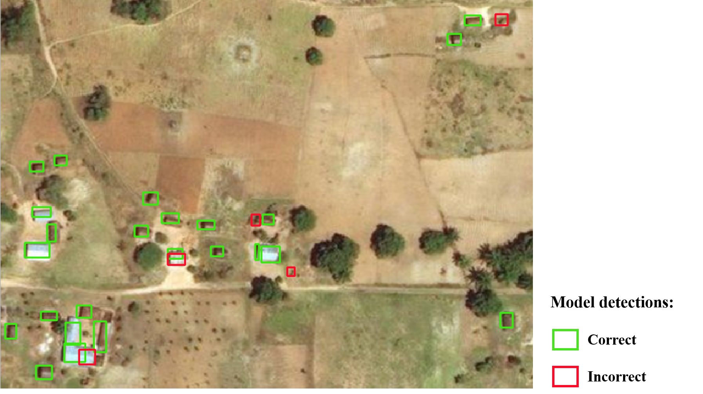

Automatic building detection with ohsome2label and Tensorflow 
==================

### Introduction

Accurate and complete geographic data of human settlement is crucial for humanitarian aid and disaster response. 
OpenStreetMap (OSM) can serve as a valuable source, especially for global south countries where buildings are largely unmapped.

In this walkthrough, we will show you how to train a building detection model with massive OSM building geometries using ohsome2label and Tensorflow object detction API. If everything works well, you will be able to train your own deep learing models and detect individual buildings in a similar manner as follows:

<p  align="center">



</p>

### Package Dependencies

* Python 3.6
* [ohsome2label](https://github.com/GIScience/ohsome2label/tree/master/ohsome2label)
* [Tensorflow](https://github.com/tensorflow/tensorflow)
* [Tensorflow object detection API](https://github.com/tensorflow/models/tree/master/research/object_detection)
* [COCO python API](https://github.com/cocodataset/cocoapi/tree/master/PythonAPI)

 
For the details of package dependencies installation, please follow the steps in [SETUP.md](SETUP.md), which will make sure you access all python package required for this walkthrough.

  
### Par1 - Prepare the training samples (OSM + satellite images)
------------

Since we noticed several finished humanitarian mapping project in kalola area, Tanzania. In this walkthrough, we will use the kalola area as an example and demonstrate how to use [ohsome2label](https://github.com/GIScience/ohsome2label/tree/master/ohsome2label) to prepare training samples for building detection model.

#### Install the ohsome2label

Clone the [ohsome2label](https://github.com/GIScience/ohsome2label) Github repo with

 ``` 
 git clone https://github.com/GIScience/ohsome2label.git
 ``` 

and install it locally
 ``` 
 pip install --editable .
 ``` 

#### Configuration

First, replace the default [config.yaml](ohsome2label/config/config.yaml) with the follow file:

```yaml
project:
  name: kalola
  workspace: ./tanzania
  project_time: 2021-3-25
  task: object detection

osm:
  api: ohsome
  url: https://api.ohsome.org/v1/elements/geometry
  bboxes: [32.463226318359375, -5.032122934090069, 32.48931884765625, -5.019810836520875]
  tags:
    - {'label': 'building', 'key': 'building', 'value': ''}
    timestamp: 2020-10-20
    types: polygon

image:
  img_api: bing
  img_url: http://t0.tiles.virtualearth.net/tiles/a{q}.png?g=854&mkt=en-US&token={token}
  api_token : 'REPLACE BY YOURTOKEN'
  zoom: 18
```

*Note: To know more about the meaning of parameter, please refer to the homepage of [ohsome2label](https://github.com/GIScience/ohsome2label/tree/master/ohsome2label). Moreover, you need to provide user specific `api_token` (e.g., for Bing satellite image, [you can apply here](https://www.bingmapsportal.com/) )*


#### Run ohsome2label

Once we successfully replace `config.yaml` in the `config/` folder, we can start the process of data acquisition of OSM features and satellite images. Navigate to the `./ohsome2label/` directory where you cloned the ohsome2label repo and follow these steps:


* Download OSM data:

```shell
$ ohsome2label vector
```

* Generate labels:

```shell
$ ohsome2label label
```

<p  align="center">


</p>

* Download satellite images:

```shell
$ ohsome2label image
```

<p  align="center">



</p>

* preview the labels and satellite images:

```shell
$ ohsome2label visualize -t overlay
```

<p  align="center">



</p>

#### Covert training record

Copy [tf_record_from_coco.py together with dataset_util.py](tf_record_from_coco.py) to the `./ohsome2label/` directory where you have your `./tanzania` data folder generated by ohsome2label.

* Generate TFRecords:

```shell
$ python tf_record_from_coco.py  
    --label_input=./tanzania \
    --train_rd_path=./tanzania/train.record \
    --valid_rd_path=./tanzania/valid.record
```

Once you've successfully run these command, you can find `train.record` and `test.record` files in `./tanzania/`. Next step, please copy those two .record files into the cloned repo of `models/research/object_detection/data`. 

Additionally, you may find training and test images `ohsome/tanzania/train/` and `ohsome/tanzania/test/`, respectively. Please copy it to the `models/research/object_detection/image`.


Great! You have finised the process of data acquisition and preprocessing. You are ready to train your customized building detection model.

  

### Par2 - Train the building detection model ( Tensorflow OD API + Pretrained model zoo )
------------  
  

If you've already finished the installation procedures as described in [SETUP.md](SETUP.md), you can find the directory from the cloned repo: `models/research/object_detection`, which contains the necessary code for using the Tensorflow object detection problems API. In the following, please use this directory as your home folder (HF).


#### Obtain the pre-trained model


From [Tensorflow model zoo](https://github.com/tensorflow/models/blob/master/research/object_detection/g3doc/tf1_detection_zoo.md), we selected the `ssd_inception_v2_coco` network as our base model. For the detailed set up, please follow the steps:

* Download: with the link, you could download the [ssd_inception_v2_coco](http://download.tensorflow.org/models/object_detection/ssd_inception_v2_coco_2017_11_17.tar.gz), please unzip and move the folder under HF.

* Configuration: In the folder names `training`, the `ssd_inception_v2_coco.config` refer to the corresponding configuration about the training.

* Class definition: In the folder named `data`, the `building_od.pbtxt` define the object classes that your model would train on.

Here your folder structure should partly be looked like this:


```
models/research/object_detection/
├── ssd_inception_v2_coco_2017_11_17/
├── training/
│ └── ssd_inception_v2_coco.config
├── data/
│ ├── train_buildings.record
│ ├── test_buildings.record
│ └── building_od.pbtxt
├── images/
│ ├── train/
│ └── test/
├── train.py
├── export_inference_graph.py
├── tf_od_performance_evaluation.py
├── tf_od_predict_geojson.py
└── ...
```

  
 
#### Start the model training

  

It's time to start fine-tuning the pre-trained network on your own training samples. From the HF directory, run the following code:

  

```shell
python train.py --logtostderr \
--train_dir=training/ \
--pipeline_config_path=training/ssd_inception_v2_coco.config
```

Then the training will start, all the checkpoint and model coefficients would be saved under the `training` folder. The training steps run like following:

  

<p  align="center">


</p>

  

With regard to the number of training steps, you can set a number of steps in `ssd_inception_v2_coco.config` configuration file  or you could also early stop the traning. The output model coefficients would be saved as checkpoints under the `training` directory.


#### Export the model

  
First, export the building detection training graph, the output model would be saved into `building_od_ssd` directory:
  

```shell
python export_inference_graph.py 
    --input_type image_tensor \
    --pipeline_config_path training/ssd_inception_v2_coco.config \
    --trained_checkpoint_prefix training/model.ckpt-28673\
    --output_directory building_od_ssd
```
  

#### Evaluate the model
  

With the exported model, one could run the evaluation. We have split all samples in training and test, the building detection model could then be evaluated on the test dataset. 

First, apply building prediction over the test samples images using the trained model `building_od_ssd` by running:


```shell
python tf_od_predict_geojson.py --model_name=building_od_ssd \
    --path_to_label=data/building_od.pbtxt \
    --test_image_path=images/test
```

You will then find a GeoJSON file containing all predicted bounding boxes as well as their confidence scores saved under the `prediction_result/` directory. 

*Note: Please note that the bounding boxes' coordinates are in a local coordinate system with respect to where the bounding box is located within a given image tile. Transformation of bounding boxes into a common geographical coordinate system will be done in the next step.*

To perform the coordinate transformation, and obtain precision, recall and f1-score of the predicted bounding boxes when compared to the OpenStreetMap reference geometries, we run the following script:


```shell
python tf_od_performance_evaluation.py 
    --path_to_osm ohsome2label/tanzania/other/raw/building_building_.geojson \
    --test_image_path images/test/ \
    --predictions_path prediction_result/OD_prediction.geojson \
    --noresults_to_file \
    --geometries_to_file  \
    --geometries_output_folder prediction_result/
```

*Note: Since we manually checked all OSM buildings within the study area we used, the OSM data therefore can be regarded as reference data. Otherwise, a proper reference GeoJSON should be provided with the flag `--path_to_osm`.*

#### Results and visualizations

As a results, the prediction results over the test images can be found in `images/test/` as follows:

<p  align="center">


</p>

In the meanwhile, the predicted buildings with geographical coordinates were saved into the `prediction_result/OD_prediction.geojson` and can be visualized in any desk GIS as follows:

<p  align="center">



</p>

Furthermore, one can observed a very promising detection results regarding precision, recall and f1 scores. For instance, by training the model for around 50k steps, we obtained the following values over the test image set.

| Metrics | Description | Values |
| -- | -- | -- |
| **Precision** | how precise the model detect buildings | 86.76 |
| **Recall** | to which extend the model can detect buildings mapped in OSM | 85.07 |
| **f1 score** | the harmonic mean of the precision and recall | 85.91 |

### Wrap up

This walkthrough aims to demonstrate a flexible method of training automatic building detector by combining [ohsome2label](https://github.com/GIScience/ohsome2label/tree/master/ohsome2label) with the well-know [Tensorflow Object detection API](https://github.com/tensorflow/models/tree/master/research/object_detection) in an end-to-end and easy-to-extend manner. Ideally, this method could be applied to any regions in case "enough" OSM training data is available.

Thanks for your interests, stay tuned for more [ohsome](https://github.com/GIScience/ohsome-api) news!
 


